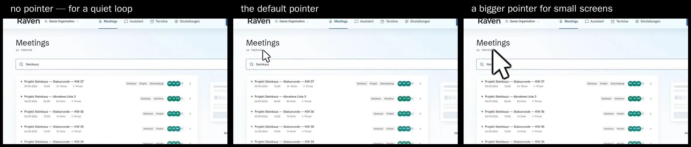
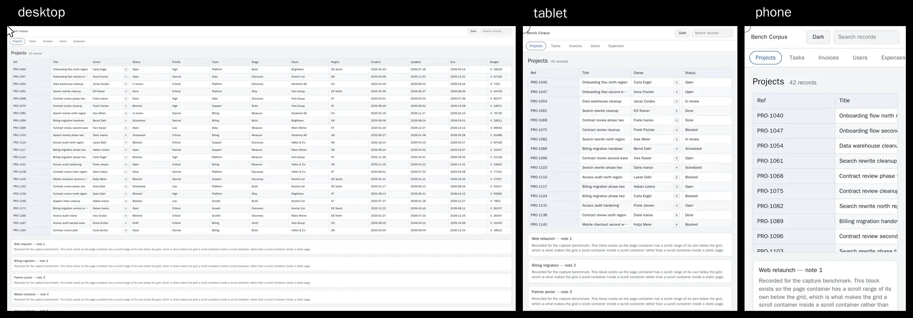
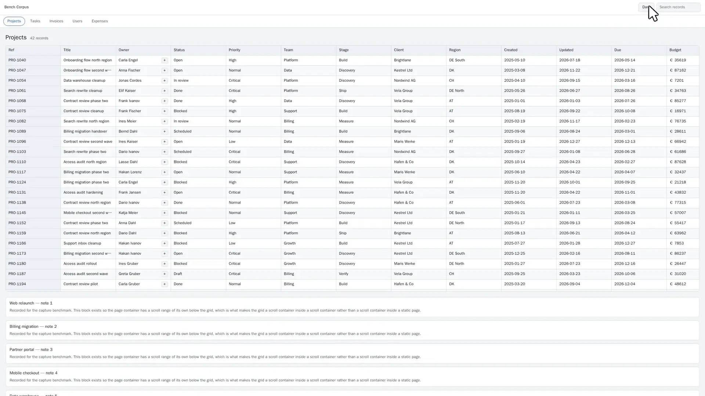
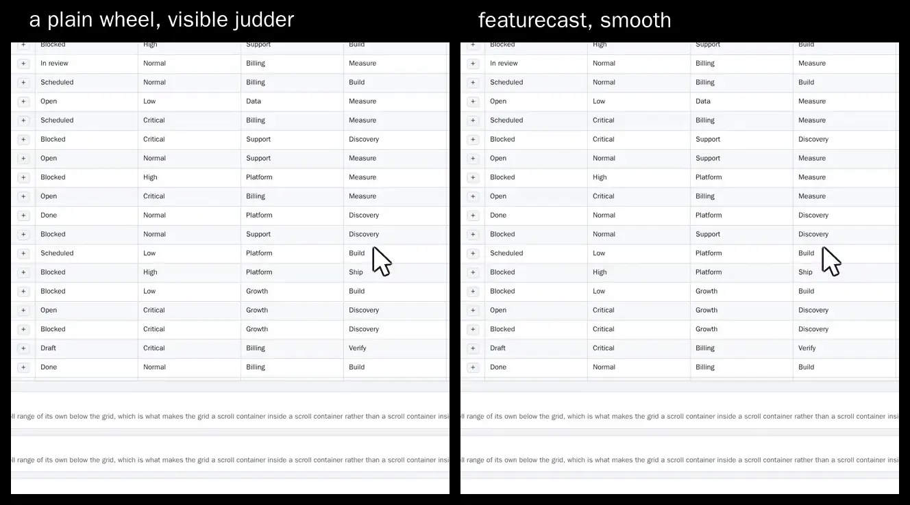

# featurecast

**Turn your Playwright script into a product demo video.** Nothing is burned into the recording — cursor, zoom and framing are rendered afterwards, from a log.

One browser run produces two things: clean raw footage and an event log of where the pointer went, what was clicked and which element it hit. Everything you can see in the finished video is decided after that. Changing the look is a re-render of seconds, not another browser run.

[](https://opensource.org/licenses/MIT)

---

## One recording, every look



Three versions of one browser run. The application behind them is the same
pixels in all three, at the same instant — only the pointer is different,
because the pointer is not in the recording. It is drawn afterwards from the
log of where it went.

That is what makes "can we have a bigger cursor" a re-render of a few seconds
instead of another visit to the application. And the motion cannot drift while
you try things, because nothing was recorded again.

```bash
pnpm compare plain/16-9.mp4 default/16-9.mp4 big/16-9.mp4 --out looks.mp4 \
  --label "no pointer" --label "the default pointer" --label "a bigger pointer"
```

---

## Landing page, phone and social post



Three videos out of one script. The wide one for the landing page, the tall
one for the phone, the one in between for a tablet or a post — and each was
filmed on that device, not cut out of the wide one afterwards.

That is the difference a viewer notices without knowing why. On the phone
video the application _is_ the phone version: bigger type, one column, a
fingertip instead of a mouse pointer. A crop out of a desktop take gives you a
desktop screen squeezed into a phone-shaped hole.

```bash
pnpm featurecast run demo/fixture-tour.ts --devices desktop,tablet,iphone
```

Twelve devices are ready to name, and every phone and tablet Playwright knows
works too — [docs/DEVICES.md](docs/DEVICES.md) lists them. If you do want all
three shapes out of a single take anyway, `--all-formats` still delivers them.

One of the twelve is `desktop-4k`, and it comes with two conditions worth
reading before you reach for it.

**4K is a preset, not a promise about frame rate.** `desktop-4k` records and
delivers 3840×2160 at 98.6 % yield, but the browser stops presenting sixty
frames a second at that size: the median gap between presented frames is
20.52 ms against 16.76 ms at 2560×1600. So: 4K, yes. 4K at 60, no.

**At 4K the camera holds still.** The output is the whole capture area, so
there is no reserve to crop into and every push-in clamps to 1.00×. For a
large picture _and_ a moving camera, give the standard `desktop` preset
`reserve: 2`: it records 3840×2160 for its 1920×1080 delivery, a 2× reserve
instead of the usual 1.33×.

<!--
  Two further comparisons and a full product video exist as full-resolution
  60 fps MP4 and are deliberately not committed: GitHub renders an .mp4 from
  the repository tree as a link rather than a player, and what each one
  demonstrates (sharpness, frame yield) is exactly what a 128-colour GIF
  destroys. They are uploaded once through GitHub's attachment lane and their
  URLs pasted in here. See issue #103 for the sources.
-->

---

## The camera goes where you clicked



Nobody framed this by hand. The video pushes in on the button that was
pressed and pulls back out again, because the recording knows which element
the click hit. Want it tighter, or calmer? That is a re-render, not another
take:

```bash
pnpm render artifacts/tour/desktop dist/tour --zoom 2.2 --padding 90
```

It moves in by cropping into the original picture, never by blowing it up, so
it only goes as close as the recording stays sharp — and it tells you when you
have asked for more than that. A phone is filmed at 1.5× the size it is
delivered, so the camera can move in up to 1.5× there too, at the full 60
frames a second; `--reserve 1` films it at exactly its delivery size when disk
and time matter more than the camera.

---

## Quick Start

Node 22 or newer, pnpm, and ffmpeg on the path.

```bash
git clone https://github.com/PhilflowIO/featurecast.git
cd featurecast
pnpm install
pnpm browsers:install
```

Record and render an example that needs no account and no network:

```bash
pnpm featurecast run demo/feature-xy.ts --devices desktop-wide
```

Record on a quiet machine with a GPU: the browser paints the page in real
time, and on a busy or GPU-less machine a scroll judders. `featurecast run`
refuses a software renderer; `tools/gpu-box/record.sh` runs the same command
on a GPU host and brings the clip back — see
[docs/RECORDING-SCRIPTS.md](docs/RECORDING-SCRIPTS.md#where-to-record-a-quiet-host-with-a-gpu).

Next to the recording you get a folder with the finished video and the
`decisions.json` that produced it. Restyle it without touching the browser:

```bash
pnpm render artifacts/feature-xy/desktop-wide dist/feature-xy \
  --padding 40 --cursor-size 32
```

Your own script becomes a recording script by exporting the body of the
recording and routing its interactions through `demo` instead of `page`:

```ts
import type { Demo, RecordPage } from '../src/record.js'

export const url = 'https://app.example.com'

export default async function featureXy(page: RecordPage, demo: Demo) {
  await page.goto('https://app.example.com/new-feature')
  await demo.point('#nav-settings') // smooth approach, no click
  await demo.click('#toggle-dark-mode')
  await demo.hold(1200) // let the effect land
}
```

Signed-in sessions, cookie banners and frozen clocks are covered in
[docs/RECORDING-SCRIPTS.md](docs/RECORDING-SCRIPTS.md).

---

## Where the decisions live

The split between what the browser burns in and what stays adjustable is the
whole idea:

| Decision                      | In a screen recording        | In featurecast                       |
| ----------------------------- | ---------------------------- | ------------------------------------ |
| Cursor shape, size, ripple    | captured pixels              | drawn at render time, from the log   |
| Which element the zoom frames | captured pixels              | the logged bounding box of the click |
| Aspect ratio                  | fixed at capture             | 16:9, 9:16 and 1:1 from one take     |
| Idle passages                 | cut by hand                  | compressed from frame timestamps     |
| Changing any of the above     | record the interaction again | re-run the renderer                  |

Two consequences worth naming, because they are unusual:

**A format is only delivered at a size the capture can pay for.** A 2560×1600
desktop capture does not contain a sharp 1080×1920 portrait frame — the
largest 9:16 rectangle in it is 900×1600. featurecast delivers 900×1600 at
full sharpness and says so, instead of upscaling.

**Same decisions, same video, byte for byte.** Cropping, scaling and cursor
drawing happen frame by frame in our own code rather than in ffmpeg's filter
graph, because a time-driven command channel was not reproducible: six
identical runs produced four different videos.

---

## Scrolling that does not look cheap

A wheel moves a page in lumps — one jump per notch — and at 60 frames a second
a viewer sees every one of them. That judder is the first thing that gives a
demo video away. featurecast covers the same distance in eased steps instead,
so the picture never leaps between two frames.

The same 700 px of sideways travel, in the same time, through the same three
columns of the same table. Left: whole 38.9 px wheel packets, the procedure
this tool used to have. Right: eased steps, never more than 30 px between two
frames. Nothing else differs — same script, same page, same browser.



---

## What you get today, honestly

Capture yield is the share of frames the browser presented that actually
reached the file.

| Browser                                         | Yield                                   |
| ----------------------------------------------- | --------------------------------------- |
| **The one `pnpm browsers:install` gives you**   | **98.8 %** (338 of 342, three of three) |
| Chromium 153, the bundle before Playwright 1.64 | **84-88 %**, and it fails the 95 % gate |

Measured on the benchmark machine, 2026-09-17, at 2560×1600 with the same tour
and three repeats per arm.

**The top row is what you get out of the box.** featurecast pins a Playwright
that ships a stock Chrome for Testing 154 — no patched build, nothing to
compile. `CHROME_BIN` still points a run at any other Chromium; one older than
154 records fine, it just lands in the second row.

**What changed, and why the number moves so much.** Chromium stops handing out
screencast frames once too many are unacknowledged, and its default bound of
three is too low for a 2560×1600 capture: the same run scores 82-90 % at three
and 98.8 % at twelve. Playwright's screencast wrapper cannot pass that bound at
all, so featurecast drives the recording over the browser protocol directly.
This used to require a self-built Chromium; since Chromium 154 it no longer
does.

**There is no longer a second reason to build your own browser.** The patched
build also switched off Chromium's `AnimatedContentSampler`, which locks onto
one damage region during an animation and was blamed for a visible judder in
sideways scrolling. Measured against three instruments — capture yield, frame
cadence, and smoothness of the finished video — at both queue depths, nine runs:
switching it off changes nothing any of them can see. The judder that was
attributed to it belonged to the starved frame queue next door. Full analysis in
[docs/CAPTURE-CADENCE.md](docs/CAPTURE-CADENCE.md).

Nothing here has ever been measured against another product. This README
makes no claim about how featurecast compares to any tool you may be using.

Status: pre-1.0, not published to npm, interfaces still move between
milestones. [MILESTONES.md](MILESTONES.md) lists what is accepted and what is
not, each with a criterion you can run yourself.

---

## Documentation

- **[docs/RECORDING-SCRIPTS.md](docs/RECORDING-SCRIPTS.md)** — turn an existing Playwright script into a recording
- **[docs/DEVICES.md](docs/DEVICES.md)** — the eleven device presets and how they resolve
- **[PLAN.md](PLAN.md)** · **[MILESTONES.md](MILESTONES.md)** — architecture and acceptance criteria
- **[docs/INTERNALS.md](docs/INTERNALS.md)** — how it works in full detail
- **[docs/YIELD-BENCH.md](docs/YIELD-BENCH.md)** — measure capture yield yourself
- **[docs/CAPTURE-CADENCE.md](docs/CAPTURE-CADENCE.md)** · **[docs/SMOOTHNESS.md](docs/SMOOTHNESS.md)** · **[docs/M1-VERDICT.md](docs/M1-VERDICT.md)** · **[docs/M3-VERDICT.md](docs/M3-VERDICT.md)** · **[docs/M4-ACCEPTANCE.md](docs/M4-ACCEPTANCE.md)** — the measurement record

---

## Contributing

Pull requests are welcome — see [CONTRIBUTING.md](CONTRIBUTING.md).

## License

MIT — see [LICENSE](LICENSE). Third-party code and its origins are listed in
[THIRD-PARTY.md](THIRD-PARTY.md).
