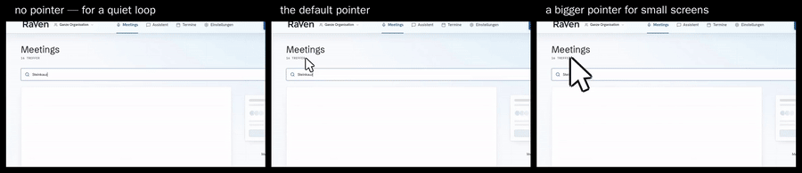
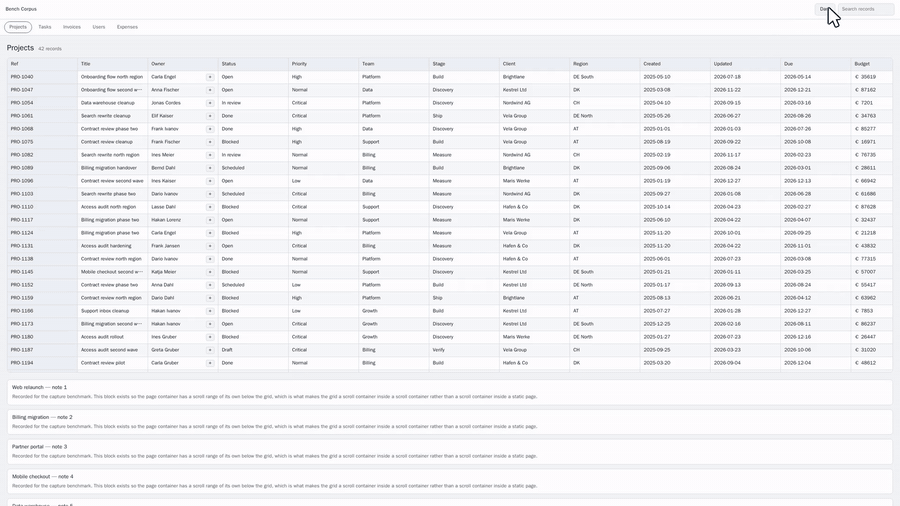
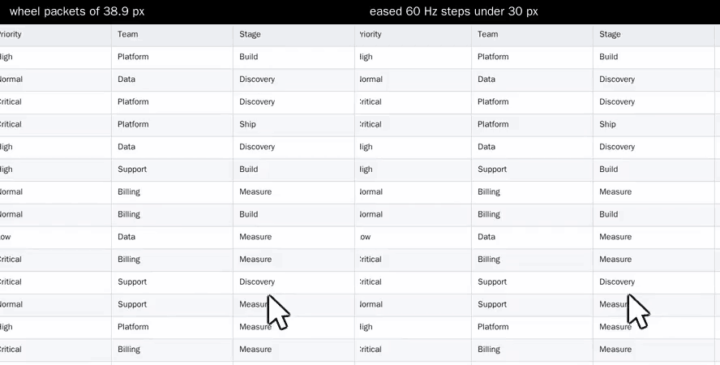

# featurecast

**Turn your Playwright script into a product demo video.** Nothing is burned into the recording — cursor, zoom and framing are rendered afterwards, from a log.

One browser run produces two things: clean raw footage and an event log of where the pointer went, what was clicked and which element it hit. Everything you can see in the finished video is decided after that. Changing the look is a re-render of seconds, not another browser run.

[](https://opensource.org/licenses/MIT)

---

## One recording, every look



Three versions of one browser run. The application behind them is the same
pixels in all three, at the same instant — only the pointer is different,
because the pointer is not in the recording. It is drawn afterwards from the
log of where it went.

That is what makes "can we have a bigger cursor" a re-render of a few seconds
instead of another visit to the application. And the motion cannot drift while
you try things, because nothing was recorded again.

```bash
pnpm compare plain/16-9.mp4 default/16-9.mp4 big/16-9.mp4 --out looks.mp4 \
  --label "no pointer" --label "the default pointer" --label "a bigger pointer"
```

---

## Every device is filmed as that device


Three separate runs of one script. The phone is not a slice cut out of the
desktop take — it is a phone: its own viewport, its own layout, its own type
size, and a round fingertip instead of an arrow. The shapes differ in the
picture because they differ in the device.

That is the part a crop cannot fake. A tall video cut out of a wide recording
shows a desktop layout in a phone-shaped hole; this shows what the application
does when it believes it is on a phone.

```bash
pnpm featurecast run demo/fixture-tour.ts --devices desktop,tablet,iphone
```

Eleven presets are curated and every name in Playwright's own device registry
resolves too — [docs/DEVICES.md](docs/DEVICES.md) lists them. Any one of those
recordings can still be delivered as 16:9, 9:16 and 1:1 at once
(`--all-formats`), cropped out of that device's own take, which is what a crop
is honestly for.

<!--
  Two further comparisons and a full product video exist as full-resolution
  60 fps MP4 and are deliberately not committed: GitHub renders an .mp4 from
  the repository tree as a link rather than a player, and what each one
  demonstrates (sharpness, frame yield) is exactly what a 128-colour GIF
  destroys. They are uploaded once through GitHub's attachment lane and their
  URLs pasted in here. See issue #103 for the sources.
-->

---

## The camera goes where the click went



Nobody framed this by hand. The recording logged which element the click hit,
and the renderer moved the frame onto that element and back out again
afterwards. Change your mind about how tight it should sit and it is a
re-render, not another browser run:

```bash
pnpm render artifacts/tour/desktop dist/tour --zoom 2.2 --padding 90
```

The push-in is a crop of the original, never a magnification. A 2560×1600
capture delivered as 1920×1080 has 1.33× to spend, so that is as close as the
camera goes, and the renderer says so instead of inventing pixels. A phone
recording has no such reserve today — it is captured at exactly the size it is
delivered — so on a phone the camera holds still.

---

## Quick Start

Node 22 or newer, pnpm, and ffmpeg on the path.

```bash
git clone https://github.com/PhilflowIO/featurecast.git
cd featurecast
pnpm install
pnpm browsers:install
```

Record and render an example that needs no account and no network:

```bash
pnpm featurecast run demo/feature-xy.ts --devices desktop-wide
```

Next to the recording you get a folder with the finished video and the
`decisions.json` that produced it. Restyle it without touching the browser:

```bash
pnpm render artifacts/feature-xy/desktop-wide dist/feature-xy \
  --padding 40 --cursor-size 32
```

Your own script becomes a recording script by exporting the body of the
recording and routing its interactions through `demo` instead of `page`:

```ts
import type { Demo, RecordPage } from '../src/record.js'

export const url = 'https://app.example.com'

export default async function featureXy(page: RecordPage, demo: Demo) {
  await page.goto('https://app.example.com/new-feature')
  await demo.point('#nav-settings') // smooth approach, no click
  await demo.click('#toggle-dark-mode')
  await demo.hold(1200) // let the effect land
}
```

Signed-in sessions, cookie banners and frozen clocks are covered in
[docs/RECORDING-SCRIPTS.md](docs/RECORDING-SCRIPTS.md).

---

## Where the decisions live

The split between what the browser burns in and what stays adjustable is the
whole idea:

| Decision                      | In a screen recording        | In featurecast                       |
| ----------------------------- | ---------------------------- | ------------------------------------ |
| Cursor shape, size, ripple    | captured pixels              | drawn at render time, from the log   |
| Which element the zoom frames | captured pixels              | the logged bounding box of the click |
| Aspect ratio                  | fixed at capture             | 16:9, 9:16 and 1:1 from one take     |
| Idle passages                 | cut by hand                  | compressed from frame timestamps     |
| Changing any of the above     | record the interaction again | re-run the renderer                  |

Two consequences worth naming, because they are unusual:

**A format is only delivered at a size the capture can pay for.** A 2560×1600
desktop capture does not contain a sharp 1080×1920 portrait frame — the
largest 9:16 rectangle in it is 900×1600. featurecast delivers 900×1600 at
full sharpness and says so, instead of upscaling.

**Same decisions, same video, byte for byte.** Cropping, scaling and cursor
drawing happen frame by frame in our own code rather than in ffmpeg's filter
graph, because a time-driven command channel was not reproducible: six
identical runs produced four different videos.

---

## Scrolling that does not look cheap

A wheel moves a page in lumps — one jump per notch — and at 60 frames a second
a viewer sees every one of them. That judder is the first thing that gives a
demo video away. featurecast covers the same distance in eased steps instead,
so the picture never leaps between two frames.

The same 700 px of sideways travel, in the same time, through the same three
columns of the same table. Left: whole 38.9 px wheel packets, the procedure
this tool used to have. Right: eased steps, never more than 30 px between two
frames. Nothing else differs — same script, same page, same browser.



---

## What you get today, honestly

Capture yield is the share of frames the browser presented that actually
reached the file.

| Browser                                 | Yield                                               |
| --------------------------------------- | --------------------------------------------------- |
| Self-built, patched Chromium            | **99.6 %** (3595 of 3610, gate 95 %)                |
| The Chromium that ships with Playwright | **84 %** ([docs/M1-VERDICT.md](docs/M1-VERDICT.md)) |

Measured on the benchmark machine, 2026-09-17 and 2026-09-11 respectively.

**If you start today, you get 84 %.** There is no downloadable artifact of the
patched build; building it yourself is the only route, and packaging it is an
open issue. At 84 % the loss is not evenly spread — it concentrates in
horizontal scrolling right after a vertical one, and it is visible, not just
measurable. The mechanism is Chromium's `AnimatedContentSampler` locking onto
one damage region; the full analysis is in
[docs/CAPTURE-CADENCE.md](docs/CAPTURE-CADENCE.md).

Nothing here has ever been measured against another product. This README
makes no claim about how featurecast compares to any tool you may be using.

Status: pre-1.0, not published to npm, interfaces still move between
milestones. [MILESTONES.md](MILESTONES.md) lists what is accepted and what is
not, each with a criterion you can run yourself.

---

## Documentation

- **[docs/RECORDING-SCRIPTS.md](docs/RECORDING-SCRIPTS.md)** — turn an existing Playwright script into a recording
- **[docs/DEVICES.md](docs/DEVICES.md)** — the eleven device presets and how they resolve
- **[PLAN.md](PLAN.md)** · **[MILESTONES.md](MILESTONES.md)** — architecture and acceptance criteria
- **[docs/INTERNALS.md](docs/INTERNALS.md)** — how it works in full detail (German)
- **[docs/CAPTURE-CADENCE.md](docs/CAPTURE-CADENCE.md)** · **[docs/SMOOTHNESS.md](docs/SMOOTHNESS.md)** · **[docs/M1-VERDICT.md](docs/M1-VERDICT.md)** · **[docs/M3-VERDICT.md](docs/M3-VERDICT.md)** · **[docs/M4-ACCEPTANCE.md](docs/M4-ACCEPTANCE.md)** — the measurement record (German)

---

## Contributing

Pull requests are welcome — see [CONTRIBUTING.md](CONTRIBUTING.md).

## License

MIT — see [LICENSE](LICENSE). Third-party code and its origins are listed in
[THIRD-PARTY.md](THIRD-PARTY.md).
